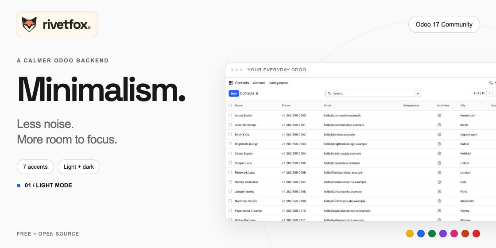
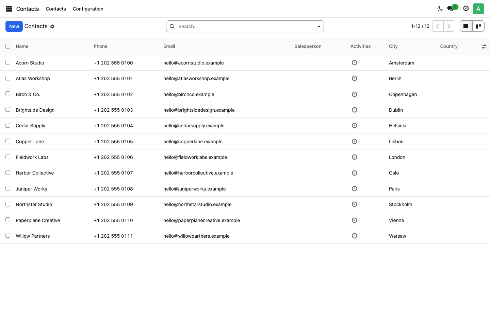
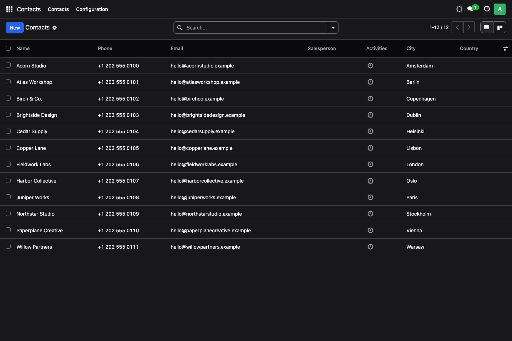
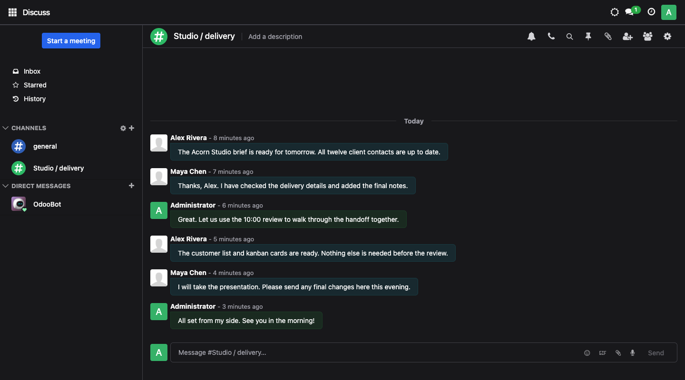

# Minimalism — Odoo 17 Community backend theme

A calmer Odoo workspace inspired by [shadcn/ui](https://ui.shadcn.com): neutral zinc surfaces, fine borders, rounded controls, clear typography and restrained accents. Built by [RivetFox](https://rivetfox.pro), with native Odoo views and Owl controls.



- Personal light/dark mode in the top bar, without reloading or losing open work.
- Seven shared accent presets, managed by Settings administrators.
- Avatar → **Appearance**: enable/disable, comfortable/compact tables and reset.
- Native dark styles for forms, lists, kanban, Discuss, Calendar, CRM, Project and standard graph/pivot views.
- No external fonts, CDNs, React, Tailwind or additional Python packages.

## Supported versions

All releases target self-hosted Odoo Community. Choose the matching branch; the technical module name is `minimalism_theme` on every version.

| Odoo | Branch | Release |
| --- | --- | --- |
| 16.0 | [16.0](https://github.com/Welgum/odoo-minimalism-theme/tree/16.0) | `16.0.1.0.0` |
| 17.0 | [17.0](https://github.com/Welgum/odoo-minimalism-theme/tree/17.0) | `17.0.1.0.0` |
| 18.0 | [18.0](https://github.com/Welgum/odoo-minimalism-theme/tree/18.0) | `18.0.1.0.0` |
| 19.0 | [19.0](https://github.com/Welgum/odoo-minimalism-theme/tree/19.0) | `19.0.1.1.0` |

This checkout targets **Odoo 17**. `main` follows `19.0`. Each branch includes its own compatibility adapters, real screenshots and validation record.

## Install

Download only the matching add-on into your add-ons directory (example for this branch):

```sh
curl -fsSL https://codeload.github.com/Welgum/odoo-minimalism-theme/tar.gz/refs/heads/17.0 | tar -xz --strip-components=1 odoo-minimalism-theme-17.0/minimalism_theme
```

Or clone the source with `git clone --branch 17.0 --single-branch https://github.com/Welgum/odoo-minimalism-theme.git`. Then:

1. Extract `dist/minimalism_theme-17.0.1.0.0.zip` into your configured add-ons directory, or add this repository root to `addons_path`.
2. Confirm the deployable path is `ADDONS_PATH/minimalism_theme/__manifest__.py`.
3. Restart Odoo, update the Apps list in developer mode, remove the **Apps** filter, and install **Minimalism Backend Theme**.

For a command-line installation in your existing Odoo runtime:

```sh
odoo -d YOUR_DATABASE -i minimalism_theme --stop-after-init
```

Dependencies: `web`, `base_setup`. Optional applications and fictional records shown in screenshots are not installed by the theme.

## Appearance

**Settings → Minimalism** selects Yellow, Blue (default), Green, Purple, Pink, Orange or Red. This setting is database-wide and restricted to Settings administrators. Save it and reload each open Odoo session to receive the new preset. It does not broadcast live or vary by company.

Every internal user can switch day/night with the sun/moon button. Avatar → **Appearance** controls personal enablement and table spacing. Turning the theme off restores the appearance loaded at login, including native dark mode. Using the top-bar switch re-enables the theme. Reset clears personal choices and follows the original Odoo mode; it does not reset the shared accent.

Preferences stay in local browser storage, isolated by origin, database and user, and synchronize between tabs for the same identity. They do not sync across devices. When storage is unavailable, controls still work for the current page. No global Odoo color-scheme cookie is changed.

Stylesheets load before being activated. Failed or timed-out loads retain the last usable appearance and allow retry. Mode changes preserve unsaved forms, Discuss drafts, current navigation and business records.

## Screenshots





## Development and validation

`./tools/dev_setup.sh` provisions a disposable local Docker stack (Odoo 17 and PostgreSQL 17, admin/admin) on loopback port 19067. Set `MIN_DEV_PORT` to use another port. Its database and filestore live under ignored `dist/compose/`. Stop it with `docker compose stop`; do not point the regression tools at production.

```sh
npm ci
npx playwright install chromium
npm test
# Disposable database only; these suites create fixtures and change shared settings.
export MIN_TEST_URL=http://127.0.0.1:19067
export MIN_TEST_DB=minimalism17
export MIN_ALLOW_TEST_WRITES=1
npm run test:browser
npm run capture
npm run render
npm run build
```

Set `MIN_CHROME_PATH` to a system Chrome executable if preferred. FFmpeg is needed only for promotional animation rendering. Python 3.10+ builds the reproducible release ZIP using its standard library. Node/Playwright/FFmpeg are development tools, not installation dependencies.

See [VALIDATION.md](minimalism_theme/VALIDATION.md) for actual evidence and limits, [DESIGN.md](DESIGN.md) for implementation choices, and [PUBLISHING.md](PUBLISHING.md) for packaging.

## Troubleshooting and scope

After updating source, restart Odoo and upgrade `minimalism_theme` so Odoo regenerates assets. If styles fail to load, keep the previous appearance and retry the toggle after connectivity is restored. Disable the theme through Appearance when diagnosing a third-party view.

Backend only: website/eCommerce, portal, POS, login and PDF reports are outside scope. Enterprise, Odoo.sh, Studio, spreadsheets, specialized editors, RTL and third-party backend themes have not been certified. Use one backend theme at a time; this module never uninstalls another module automatically. Odoo Online does not accept filesystem add-ons.

LGPL-3.0-or-later. See [LICENSE](LICENSE) and [THIRD_PARTY_NOTICES.md](THIRD_PARTY_NOTICES.md). MuK informed edge-case review only; no MuK source or assets are bundled. The behavioral foundation adapts our earlier Neobrutalism theme with independent namespacing and a new visual implementation.

## RivetFox marketplace artwork

The covers, portrait catalog thumbnails and feature animations share RivetFox’s orange fox and lowercase wordmark. Source artwork and licensed local render fonts live in `tools/branding/`; the Odoo interface does not load them. See `tools/branding/README.md` for provenance.

Regenerate with `node tools/render_marketplace.cjs`, build with `python3 tools/build_release.py`, then validate all scenes and encoded animations with `node tools/check_marketplace.cjs` (Playwright, Chrome and FFmpeg required). The renderer reads the Odoo version from the manifest and uses that checkout’s own real screenshots.

Build an offline side-by-side preview with `python3 tools/preview_family.py`. It uses the sibling Neo Brutal checkout by default. Repeat `--neo-theme PATH` to include more version checkouts (the matching Neo Brutal version first). Open `dist/brand-preview/index.html`; it embeds the actual GIFs, supports pausing motion and needs no server or network.
